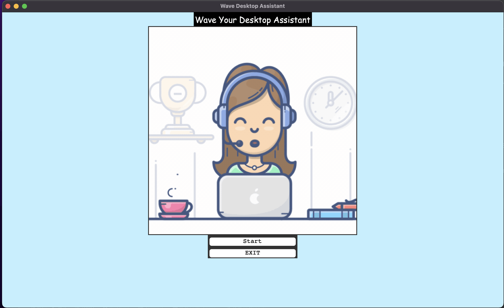

# Wave - Desktop Assistant

A context-aware GUI desktop assistant named as "Ruby" using python and python-tkinter

# Prerequisites

You must have SpeechRecognition, gTTS, playsound and wikipedia installed.

Install requirements using : pip install -r requirements.txt

#Running the project
Ensure that you are in the project home directory. Start the Desktop assistant by running below command -

``python main.py ``

If everything goes well, you should be able to see the tkinter window as below.

#Watch Demo
<a href="https://drive.google.com/file/d/1We0Vewrr5_2l_ZDmaRVIczoRBdX0gjCg/view?usp=sharing" target="_blank">Watch Wave - Desktop Assistant</a>
Click the start button to initiate interaction and there you go.

Note : Also remember to have a fast and secured internet connection to make this run. Because it is using google speech recognition api to understand the commands.